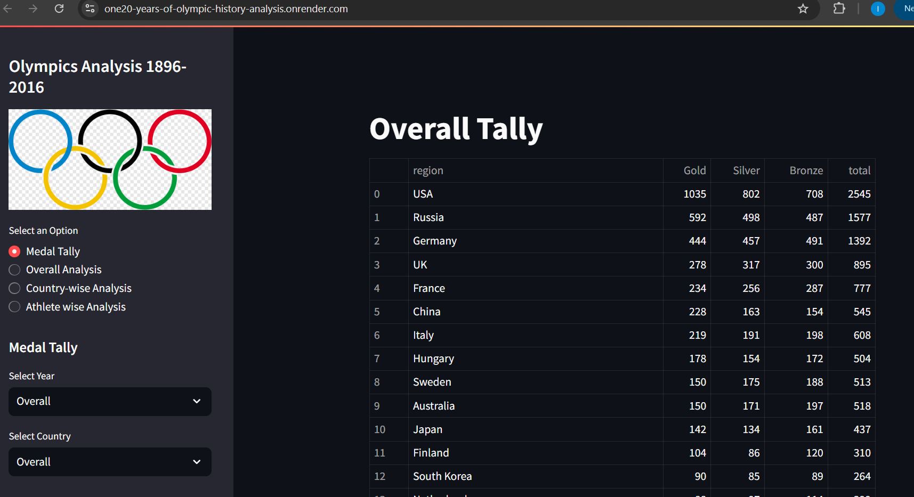

# Olympics Analysis 1896-2016

This project is a web application that provides an interactive analysis of 120 years of Olympic Games data. Users can explore medal tallies, perform country-specific analysis, and delve into athlete performance metrics.



### [View the Application](https://one20-years-of-olympic-history-analysis.onrender.com/)

**Note**: The web application is hosted on Render. Due to Render's free hosting plan, the site may take a few moments to load if it has been inactive.

## Features

- **Medal Tally**: View the medal tally by country and year. Options to filter by year and country to get specific medal counts.
- **Overall Analysis**: Provides an overview of Olympic performance, including historical trends in participation and medal distribution.
- **Country-wise Analysis**: Allows detailed analysis of a specific country’s performance over the years.
- **Athlete-wise Analysis**: Explore statistics at the individual athlete level, identifying top performers in different sports.

## Application Preview

- **Medal Tally Section**: Shows the total count of gold, silver, and bronze medals by country in a ranked format.
- **Filter Options**: Allows users to select specific years or countries for a more focused analysis.
  
## Tech Stack

- **Frontend**: HTML, CSS, JavaScript
- **Backend**: Python (Flask)
- **Data Visualization**: Matplotlib, Plotly
- **Hosting**: Render

## Dataset

Data from [Kaggle - 120 years of Olympic history](https://www.kaggle.com/heesoo37/120-years-of-olympic-history-athletes-and-results) 
was used, providing detailed records of athletes, countries, events, and medals across Summer and Winter Olympics from 1896 to 2016.
**My Dataset May vary**

## Local Setup Instructions

1. **Clone the repository**:
    ```bash
    git clone https://github.com/IshanSrivastav/120-years-of-Olympic-history-Analysis.git
    cd 120-years-of-Olympic-history-Analysis
    ```

2. **Install Requirements**:
    ```bash
    pip install -r requirements.txt
    ```

3. **Run the Application**:
    ```bash
    python app.py
    ```

4. **Access the App**:
    - Open `http://localhost:5000` in your browser.

## Deployment

The application is deployed on Render. For free deployments, please note that the server may go to sleep after periods of inactivity, causing slight delays when first accessed.

## Contributing

Contributions are welcome! Feel free to fork the project, submit issues, or make pull requests.
